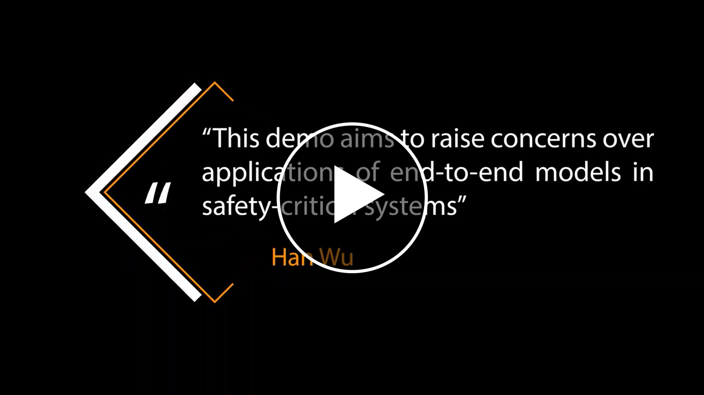
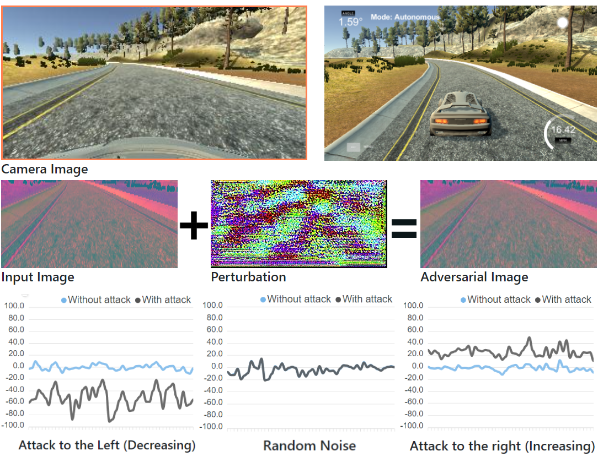
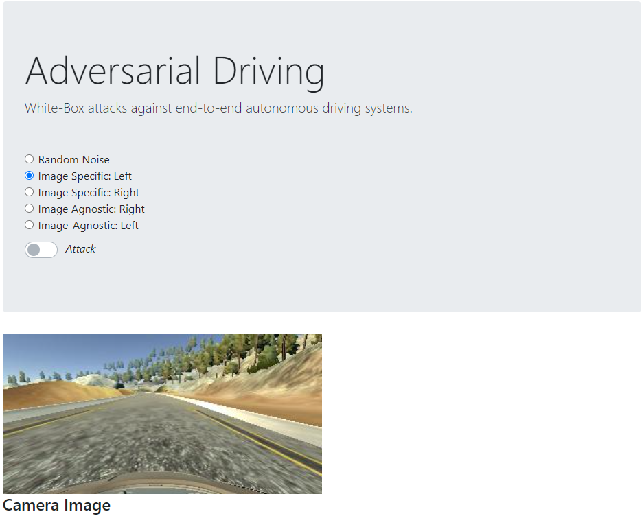
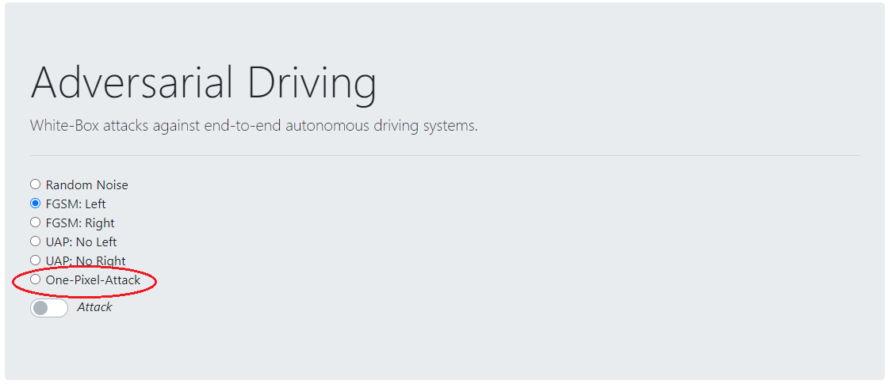

## Adversarial Driving

https://arxiv.org/abs/2103.09151

> Attacking End-to-End Autonomous Driving Systems

- [Adversarial Driving](#adversarial-driving)
  * [Overview](#overview)
  * [Quick Start](#quick-start)
    + [1. Setup the  simulator](#1-setup-the--simulator)
    + [2. Setup the server](#2-setup-the-server)
    + [3. Setup the browser](#3-setup-the-browser)
  * [How to add your own attack](#how-to-add-your-own-attack)
    + [Add the attack on the UI](#add-the-attack-on-the-ui)
    + [Implement the attack](#implement-the-attack)
  * [Training the model](#training-the-model)
  * [Resources](#resources)

### Overview

**Adversarial Driving**: The behaviour of end-to-end autonomous driving model can be manipulated by adding unperceivable perturbations to the input image.

<a href="https://youtu.be/DOdaiGxgHEs"></a>




### Quick Start

####  1. Setup the  simulator

This simulator was built for Udacity's Self-Driving Car Nanodegree, and it's available [here](https://github.com/udacity/self-driving-car-sim).

- Windows: please download **term1-simulator-windows.zip**, and open **beta_simulator.exe**.

- Linux: please download **term1-simulator-linux.zip**, and open **beta_simulator.x86_64**.

- Mac: please download **term1-simulator-mac.zip**, and install **beta_simulator_mac.app**.


####  2. Setup the server

You may use [anaconda](https://www.continuum.io/downloads) or [miniconda](https://conda.io/miniconda.html). 

```python
$ cd model
$ conda env create -f environment.yml
$ conda activate adversarial-driving
$ python drive.py model.h5
```

#### 3. Setup the browser

This is just a website, your can use any web server, just serve all the content under **client/web**.

If you use windows, click on **client/client.exe**. It's a single executable that packages everything.

For Linux and Mac, or other Unix, the server can be built with:

```
go get github.com/gobuffalo/packr
packr build
```


The web page will be available at: http://localhost:3333/



That's it!


### How to add your own attack

> This demo aims to raise concerns over applications of end-to-end models in safety-critical systems

The system is scalable to include more attacks for further research. For example, if you would like to add an attack that increases each pixel by one. (one-pixel-attack)

#### Add the attack on the UI

**First**, you can add the attack option [here](https://github.com/wuhanstudio/adversarial-driving/blob/a2841da0536bdc45e257250a3f63c6c096174985/client/web/index.html#L67) inside **client/web/index.html** by changing the `<input id="" value="one_pixel">` and `<label for="">`:

```html
<div class="form-check">
  <input class="form-check-input" type="radio" name="flexRadioDefault" id="flexRadioOnePixel" value="one_pixel">
  <label class="form-check-label" for="flexRadioOnePixel">
    One-Pixel-Attack
  </label>
</div>
```

Then you can find a new option on the website :

(Remember to recompile client.exe using `packr build` if you use the built-in server):



#### Implement the attack

**Second and last**, you can implement your attack [here](https://github.com/wuhanstudio/adversarial-driving/blob/a2841da0536bdc45e257250a3f63c6c096174985/model/adversarial_driving.py#L96) in `model/adversarial_driving.py`.

```
# One-Pixel Attack
# The attack_type == "one_pixel" here is defined in index.html in the last step.
# <input id="" value="one_pixel">
if self.attack_type == "one_pixel":
	# The attack increases each pixel by one
    noise = np.ones((160, 320, 3))
    return noise
```

**Congratulations**, now open the simulator and python server, you should see the outcome of the new attack on the website http://localhost:3333/. The one-pixel attack demonstrates how to add a new attack, but it has negligible effect on the performance of the driving model. Hope you can find a strong attack!


### Training the model

You can use the [dataset](https://d17h27t6h515a5.cloudfront.net/topher/2016/December/584f6edd_data/data.zip) from Udacity to train your own autonomous driving model. Extract the dataset to **model/data**, and the folder structure should be like this.

```
├───model
│   ├───data
│   │   ├───IMG
|   |   └───driving_log.csv
│   └───model.py
```

And then start training:

```python
python model.py
```

This will generate a file `model-<epoch>.h5` whenever the performance in the epoch is better than the previous best. More details are illustrated [here](https://github.com/udacity/CarND-Behavioral-Cloning-P3).


### Resources

- Dataset: https://d17h27t6h515a5.cloudfront.net/topher/2016/December/584f6edd_data/data.zip

- Simulator: https://github.com/udacity/self-driving-car-sim

- Project Structure: https://github.com/udacity/CarND-Behavioral-Cloning-P3

- Nvidia End-to-End model: https://developer.nvidia.com/blog/deep-learning-self-driving-cars/

- Behavior Cloning: https://github.com/naokishibuya/car-behavioral-cloning
